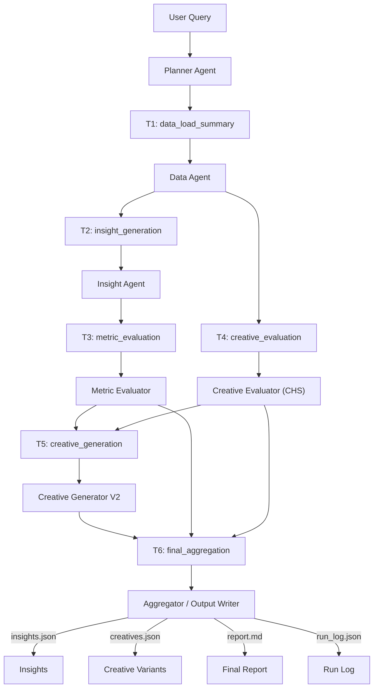

# Kasparro — Agentic Facebook Ads Performance Analyst

This repository implements an end-to-end **multi-agent system** for analyzing Meta (Facebook) ads performance, diagnosing ROAS / CTR drops, validating hypotheses quantitatively, scoring creatives with a **Creative Health Score (CHS)**, and generating **data-grounded creative variants**.

## 1. Quick Start

### 1.1. Setup

```bash
# Clone repo
git clone https://github.com/Ashish2792/kasparro-agentic-fb-analyst-ashish-ubale.git
cd kasparro-agentic-fb-analyst-ashish-ubale

# (Optional but recommended) create a virtualenv
python -m venv .venv
# Windows:
.venv\Scripts\activate
# Linux / macOS:
# source .venv/bin/activate

# Install dependencies
pip install -r requirements.txt


### 1.2. Data

By default, the system uses a **sample FB Ads dataset** under:

```text
data/sample_fb_ads.csv
```

* The assignment synthetic undergarments dataset is also expected under `data/`.
* `data/README.md` describes the expected schema and how to plug in your own CSV.

You can point to a different CSV in `config/config.yaml` (see below).

---

## 2. How to Run the System

### 2.1. Standard analysis run

```bash
python run.py "Analyze ROAS drop" --outdir reports/
```

This will:

* Read config from `config/config.yaml`
* Load and summarize the sample dataset
* Run the **Planner → Data → Insight → Evaluator → Creative → Aggregator** loop
* Produce:

```text
reports/
  ├─ insights.json    # structured hypotheses + metrics + confidences
  ├─ creatives.json   # CHS-aware creative suggestions + test plans
  └─ report.md        # human-readable summary

logs/
  ├─ PlannerAgent_<runid>.jsonl
  ├─ DataAgent_<runid>.jsonl
  ├─ InsightAgent_<runid>.jsonl
  ├─ MetricEvaluator_<runid>.jsonl
  ├─ CreativeEvaluator_<runid>.jsonl
  └─ CreativeGeneratorV2_<runid>.jsonl
```

### 2.2. Reproducibility

* Randomness is controlled via seeds in `config/config.yaml`.
* The system supports a “sample vs full” switch via config (e.g. sampling fraction), so the same command is reproducible on the **sample dataset**.

---

## 3. Repository Structure

```text
.
├─ config/
│   └─ config.yaml          # thresholds, windows, paths, seeds
├─ data/
│   ├─ sample_fb_ads.csv    # small sample dataset
│   └─ README.md            # schema + data usage notes
├─ logs/                    # JSONL agent-level logs + run logs
├─ prompts/                 # agent prompt templates (planner, evaluator, creatives)
├─ reports/
│   ├─ insights.json
│   ├─ creatives.json
│   └─ report.md
├─ src/
│   ├─ agents/
│   │   ├─ planner.py               # PlannerAgent
│   │   ├─ data_agent.py            # DataAgent (T1)
│   │   ├─ insight_agent.py         # InsightAgent (T2)
│   │   ├─ metric_evaluator.py      # MetricEvaluatorAgent (T3)
│   │   ├─ creative_evaluator.py    # CreativeEvaluatorAgent / CHS (T4)
│   │   ├─ creative_generator.py    # original creative generator
│   │   └─ creative_generator_v2.py # upgraded CreativeGeneratorV2 (T5)
│   ├─ orchestrator/
│   │   └─ aggregator.py            # final aggregation + report writer (T6)
│   └─ utils/
│       ├─ logger.py                # structured AgentLogger
│       └─ errors.py                # error wrappers and tags
├─ tests/
│   ├─ test_data_agent.py
│   ├─ test_insight_agent.py
│   ├─ test_metric_evaluator.py
│   ├─ test_creative_evaluator.py
│   ├─ test_creative_generator.py
│   ├─ test_creative_generator_v2.py
│   └─ test_planner.py
├─ run.py                    # CLI entrypoint + agent orchestration
├─ requirements.txt
└─ README.md
```

---

## 4. Full Agent Architecture

The system is structured as a **Planner–Evaluator loop** over six main tasks (T1–T6).

### 4.1. Agent graph (Mermaid)



### 4.2. PlannerAgent

**File:** `src/agents/planner.py`
**Role:** Turn a natural language query (e.g. *“Analyze ROAS drop”*) into a concrete plan (T1–T6).

* Interprets the query into:

  * `intent`: `analyze_roas`, `analyze_ctr`, `creative_optimize`, or `general_diagnosis`
  * `metrics_focus`: e.g. `["roas"]`, `["roas", "ctr"]`
  * booleans for `include_creative_analysis`, `include_audience_analysis`, `include_spend_analysis`
  * `initial_scope`: `account`, `campaign`, or `account_and_campaign`
* Emits six tasks:

  * **T1** → DataAgent (`data_load_summary`)
  * **T2** → InsightAgent (`insight_generation`)
  * **T3** → MetricEvaluator (`metric_evaluation`)
  * **T4** → CreativeEvaluator (`creative_evaluation`, CHS)
  * **T5** → CreativeGeneratorV2 (`creative_generation`)
  * **T6** → Aggregator (`final_aggregation`)
* Writes structured logs via `AgentLogger` (`PlannerAgent_<runid>.jsonl`).
* Has a `reflect_and_retry` hook: if no hypothesis reaches confidence threshold, Planner can propose a “widened window” re-run (T2b).

---

## 5. Agent Responsibilities

### 5.1. DataAgent (T1 — `data_load_summary`)

**File:** `src/agents/data_agent.py`

**Inputs:**

* CSV path (from config)
* Config:

  * `date_col` (defaults to `"date"`)
  * sampling parameters (`sample: auto`, `sample_frac`)

**Behaviour:**

* Loads the CSV and **validates schema**:

  * Ensures required columns exist (`date`, `campaign_name`, `impressions`, `clicks`, `spend`, `revenue`, etc.).
  * Coerces numeric fields, drops rows with invalid dates.
* Computes derived metrics:

  * `ctr`, `cvr`, `cpc`, `cpm`, `roas`
* Builds summary aggregations:

  * `global_daily`: account-level metrics by day
  * `campaign_daily`: per-campaign daily series
  * `campaign_summary`: per-campaign aggregates
  * `creative_summary`: per-creative aggregates
  * `creative_repetition`: simple fatigue proxy per campaign
  * `text_terms`: per-campaign term frequencies from creative text

**Output:** `data_summary` dict, used by all downstream agents.

**Robustness / P1 hardening:**

* Handles missing/extra columns gracefully (schema drift).
* Provides `dataset_meta` in `insights.json`:

  * row counts, sampling info, date range, number of campaigns/creatives.
* Logs:

  * sampling decisions
  * column inference
  * aggregation meta (counts, date coverage).

---

### 5.2. InsightAgent (T2 — `insight_generation`)

**File:** `src/agents/insight_agent.py`

**Inputs:**

* `data_summary` from DataAgent
* Intent from Planner:

  * `intent`, `metrics_focus`, `initial_scope`
* Thresholds:

  * `roas_drop_threshold_pct`
  * `low_ctr_threshold`
  * `min_impressions_for_stats`
  * window sizes (recent vs previous)

**Behaviour:**

* Splits time into **recent vs previous windows** (e.g. last 14 days vs prior 14).
* For both **account-level** and **campaign-level**, computes:

  * mean ROAS, mean CTR, spend, impressions.
* Emits **hypotheses** when:

  * ROAS change crosses configured drop threshold, and/or
  * CTR is persistently low, and there is enough volume.
* Each hypothesis includes:

  * `scope`: `overall` or `campaign`
  * `campaign_name` (if campaign scope)
  * `driver_type`: `"creative"`, `"funnel"`, `"audience"`, or `"overall"`
  * `metrics_snapshot`: prev vs recent
  * `initial_confidence`: heuristic score
  * `required_evidence`: tells evaluators what to compute (e.g. `"metric_significance"`, `"chs_trend"`).

---

### 5.3. MetricEvaluatorAgent (T3 — `metric_evaluation`)

**File:** `src/agents/metric_evaluator.py`

**Inputs:**

* `hypotheses` from InsightAgent
* `data_summary` (global / campaign daily series)
* Config:

  * `p_value_threshold`
  * `bootstrap_iters`
  * `min_impressions_for_stats`
  * window sizes

**Behaviour:**

For hypotheses that request metric evidence:

* Computes **effect size** (percentage change in ROAS or CTR).

* Approximates **statistical tests**:

  * ROAS: bootstrap difference in means over daily ROAS
  * CTR: approximate proportion test using clicks + impressions

* Computes **metric_confidence** via components:

  ```text
  metric_confidence =
      base (0.5)
    × volume_factor      (impressions & days)
    × significance_factor (p-value vs threshold)
    × stability_factor    (time coverage)
  ```

* Attaches:

  * `metric_confidence_components`:

    * `base`, `volume_factor`, `significance_factor`, `stability_factor`
  * `metric_confidence_explanation`:

    * human-readable string:

      * p-value interpretation (significant / borderline / not strong)
      * total impressions & days
      * effect size

* Sets `validated = True` when:

  * absolute effect size ≥ 5%, **and**
  * `metric_confidence ≥ 0.5`.

**Output:**

* `evaluated_hypotheses` list with:

  * `metric_confidence`
  * `validated`
  * `metric_effect_size_pct`
  * `metric_p_value_roas` / `metric_p_value_ctr`
  * `metric_sample` (days + impressions per window).

---

### 5.4. CreativeEvaluatorAgent / CHS (T4 — `creative_evaluation`)

**File:** `src/agents/creative_evaluator.py`

**Inputs:**

* `data_summary`:

  * `campaign_summary`
  * `creative_repetition`
  * `text_terms`
* `hypotheses` from MetricEvaluator
* Config:

  * `behavior_weight`, `text_weight`, `fatigue_weight`
  * `min_impressions`
  * window sizes

**Creative Health Score (CHS):**

```text
CHS = 0.5 * behavior_score
    + 0.3 * text_quality_score
    + 0.2 * fatigue_score
```

* **Behavior score:** relative performance vs peer campaigns (CTR, ROAS).
* **Text quality score:** heuristics on term usage:

  * benefit language, clarity, social proof, urgency patterns.
* **Fatigue score:** impression skew towards top creatives (higher skew → more fatigue).

**Behaviour:**

* Computes CHS per campaign for previous and recent windows:

  * `chs_prev`, `chs_recent`, `chs_delta`.
* For creative-related hypotheses, attaches:

  * `chs_components`
  * `creative_confidence`:

    * if CHS dropped a lot → higher confidence
    * if CHS improved → low confidence (creative likely not the issue)
  * `creative_confidence_components`:

    * base, `chs_delta`, behavior_prev/recent, text_quality, fatigue
  * `creative_confidence_explanation`:

    * short text like:

      > “Creative confidence 0.72 driven by CHS trend. CHS dropped by 18 points, suggesting creative performance is weakening.”

**Outputs:**

* `chs_summary`: CHS and components per campaign
* `evaluated_hypotheses`: enriched with CHS evidence.

---

### 5.5. CreativeGeneratorV2 (T5 — `creative_generation`)

**File:** `src/agents/creative_generator_v2.py`

**Inputs:**

* `data_summary`:

  * `campaign_summary`, `creative_summary`, `text_terms`
* `chs_summary` from CreativeEvaluator
* `hypotheses` from MetricEvaluator + CHS
* Params:

  * `variants_per_style`
  * `low_ctr_threshold`
  * `chs_threshold`
  * `max_campaigns`
  * `overlap_threshold`
  * `max_suggestions_per_campaign`
  * `seed` (for reproducibility)

**Behaviour:**

* Selects **target campaigns** where:

  * hypotheses indicate creative or funnel issues, and/or
  * CTR < `low_ctr_threshold`, and/or
  * CHS < `chs_threshold`.
* For each target campaign:

  * Uses `text_terms` + existing messages as grounding.
  * Generates **multiple styles** per campaign:

    * `benefit`
    * `urgency`
    * `social_proof`
    * `problem_solution`
    * `feature_highlight`
    * `audience_hook`
    * `relaxed`
  * For each suggestion, attaches:

    * `headline`, `message`, `cta`
    * `variant_style`, `core_term`
    * `overlap_score` vs existing creatives (Jaccard over tokens)
    * `risk_level` (low/medium/high)
    * `chs_targets` (which weak components it tries to fix)
    * `targeted_weakness`: e.g. `"text_quality"`, `"fatigue"`
    * `reasoning_chain`: short, explicit explanation.
  * Filters out overly similar suggestions; optionally runs a relaxed pass if too few survive.

**Outputs:**

* `creatives.json` structure:

  ```json
  {
    "creatives": [
      {
        "campaign_name": "Men Premium Modal",
        "chs_current": 49.6,
        "weak_components": ["text_quality", "behavior"],
        "suggestions": [
          {
            "id": "MODAL-001-benefit-1",
            "headline": "...",
            "message": "...",
            "cta": "Shop Now",
            "variant_style": "benefit",
            "core_term": "breathable",
            "overlap_score": 0.21,
            "risk_level": "medium",
            "chs_targets": ["text_quality"],
            "targeted_weakness": "text_quality",
            "reasoning_chain": [
              "Existing copy leans heavily on comfort but lacks concrete benefit.",
              "Introduce 'breathable' to make the benefit more specific."
            ]
          }
        ],
        "test_plan": {
          "control": "...",
          "variant_slots": [
            {"id": "MODAL-001-benefit-1", "traffic_share": 0.3},
            {"id": "MODAL-001-urgency-1", "traffic_share": 0.3}
          ]
        }
      }
    ],
    "generated_at": "...",
    "config_used": { ... }
  }
  ```

---

### 5.6. Aggregator / Output Writer (T6 — `final_aggregation`)

**File:** `src/orchestrator/aggregator.py`

* Combines:

  * `evaluated_hypotheses` from Metric & Creative evaluators.
  * `chs_summary`
  * `creatives` from CreativeGeneratorV2.
* Computes a `final_confidence` per hypothesis by combining:

  * `metric_confidence`
  * `creative_confidence` (if creative-related)
* Writes three main artifacts:

  * `reports/insights.json`

    * All hypotheses, metrics, confidences, CHS per campaign
  * `reports/creatives.json`

    * All creative suggestions and test plans
  * `reports/report.md`

    * Human-readable narrative:

      * what changed, where, with what confidence
      * creative diagnosis
      * CHS summary
      * suggested next steps

---

## 6. Logging & Error Handling

### 6.1. Structured Logging

**File:** `src/utils/logger.py`

* Every agent gets an `AgentLogger(name, run_id)` instance.
* Logs are written as **JSONL** per agent under `logs/`:

  * `PlannerAgent_<runid>.jsonl`
  * `DataAgent_<runid>.jsonl`
  * `InsightAgent_<runid>.jsonl`
  * `MetricEvaluator_<runid>.jsonl`
  * `CreativeEvaluator_<runid>.jsonl`
  * `CreativeGeneratorV2_<runid>.jsonl`

Each log line includes:

* `timestamp`
* `level` (`DEBUG`, `INFO`, `ERROR`)
* `event` (short key)
* `message` (human text)
* `payload` (structured dict with details)

This makes it easy to reconstruct what each agent did, with which parameters and counts.

### 6.2. Error Wrapping

**File:** `src/utils/errors.py`

* Provides `wrap_exc(context_message, original_exception)` to:

  * attach a high-level context string
  * keep the original traceback
* Planner and agents use this to ensure **failures are not silent**:

  * Any unexpected exception is logged and then raised with context.
* The orchestrator catches and logs errors into `logs/run_<runid>.json`.

---

## 7. Tests

**All tests pass** (`pytest`):

```bash
python -m pytest
```

### Coverage:

* `tests/test_data_agent.py` — schema, aggregation, sampling behaviour.
* `tests/test_insight_agent.py` — hypothesis generation on sample data.
* `tests/test_metric_evaluator.py` — effect size + confidence components.
* `tests/test_creative_evaluator.py` — CHS components + creative_confidence.
* `tests/test_creative_generator.py` — original generator sanity checks.
* `tests/test_creative_generator_v2.py` — V2 generator on synthetic data; checks structure & required keys.
* `tests/test_planner.py` — verifies plan structure (T1–T6, dependencies, query_info fields).

This provides both **agent-level** and **pipeline-style** coverage.

---

## 8. Example Outputs (High Level)

After running:

```bash
python run.py "Analyze ROAS drop" --outdir reports/
```

You’ll see:

* `insights.json`:

  * `query_info`: interpreted intent & metrics focus
  * `dataset_meta`: rows, sampling, date range, n_campaigns, n_creatives
  * `hypotheses`: each with:

    * `scope`, `campaign_name`, `driver_type`
    * `metrics_snapshot` (prev vs recent)
    * `metric_confidence` + explanation
    * `creative_confidence` + explanation (if applicable)
    * `final_confidence`
* `creatives.json`:

  * Per campaign:

    * CHS values
    * weak components
    * creative suggestions with:

      * style, core_term, risk_level, overlap_score
      * reasoning_chain
* `report.md`:

  * Human narrative of:

    * where ROAS/CTR moved
    * which campaigns are at risk
    * CHS breakdown
    * suggested creative experiments.

---

## 9. Notes & Assumptions

* The system is deliberately **LLM-agnostic** in the core architecture:

  * Reasoning is encoded in agents and prompt structures.
  * Metric/CHS computation is numeric and deterministic.
* CHS and confidence scores are meant to be **directional**, not strict statistical guarantees.
* Creative suggestions may occasionally look slightly unusual; the priority is:

  * diversity,
  * safety,
  * and alignment with campaign-level patterns (terms, benefits, fatigue).

---

If you have questions about any specific agent, data transformation, or test, you can inspect the docstrings at the top of each `src/agents/*.py` file – each one documents its inputs, outputs, and assumptions.

```
